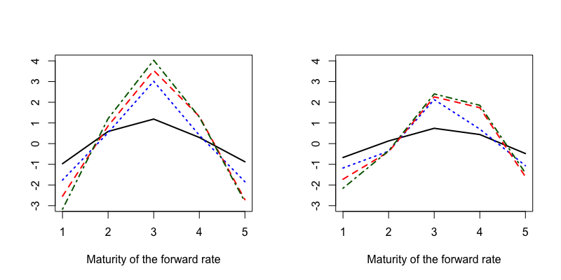

[](http://quantlet.de/)

## [](http://quantlet.de/) **PAMCocPia** [](http://quantlet.de/)

```yaml

Name of Quantlet: PAMCocPia

Published in: submitted to N/A 

Description: ‘Plots coefficients of forward factors as explanation variables in a model by Cochrane, J. H. and Piazzesi, M., Bond Risk Premia, American Economic Review, 95: 138 - 169, 2005. Compares the shape of lines for the original sample size from January 1964 to December 2003 and a prolonged sample size from January 1961 to December 2011.’

Keywords: ‘linear model, regression, plot, visualization, forward rate, bond return’

See also: ‘PAMsimLR, PAMsimCP, PAMinsam, PAMoutsam’

Author: Lenka Zboňáková

Submitted:  23 May 2018 by Lenka Zboňáková

Datafile:  BRP_data.csv
  
```



### R Code
```r

# Clear all variables
rm(list = ls(all = TRUE))
graphics.off()

# Set directory
# setwd("")

# Load Bond Risk Premium data
tmpdataCP     = read.csv("BRP_data.csv", sep=",")
dataCP        = sapply(subset(tmpdataCP, select = c(2:(dim(tmpdataCP)[2]))), as.numeric)
datesCP       = as.Date(as.character(as.POSIXct(as.character(tmpdataCP[, 1]), 
                                                format = "%Y%m%d")))
covariatesCP  = as.matrix(dataCP[, 5:dim(dataCP)[2]])

# Time span of the data in (Cochrane and Piazzesi, 2005) is 1964 - 2003
start.CP1 = grep("1964", datesCP)[1]
end.CP1   = grep("2003", datesCP)[12] 

# Observations of the vector of forward rates, 1964 - 2003
covariatesCP1  = covariatesCP[start.CP1:end.CP1, 1:5]
n.obs1         = dim(covariatesCP1)[1]

# Longer time span, 1961 - 2011
start.CP2 = grep("1961", datesCP)[1] 
end.CP2   = grep("2011", datesCP)[12] 

# Observations of the vector of forward rates, 1961 - 2011
covariatesCP2  = covariatesCP[start.CP2:end.CP2, 1:5]
n.obs2         = dim(covariatesCP2)[1]

# Excess log returns (2 to 5 years), 1964 - 2003
BRP2CP1        = dataCP[start.CP1:end.CP1, 1]
BRP3CP1        = dataCP[start.CP1:end.CP1, 2]
BRP4CP1        = dataCP[start.CP1:end.CP1, 3]
BRP5CP1        = dataCP[start.CP1:end.CP1, 4]

# Excess log returns (2 to 5 years), 1961 - 2011
BRP2CP2        = dataCP[start.CP2:end.CP2, 1]
BRP3CP2        = dataCP[start.CP2:end.CP2, 2]
BRP4CP2        = dataCP[start.CP2:end.CP2, 3]
BRP5CP2        = dataCP[start.CP2:end.CP2, 4]

# Cochrane and Piazzesi (2005): model with forward rates only, 1964 - 2003
object.brp2cp1 = lm(BRP2CP1 ~ covariatesCP1)
beta.brp2cp1   = object.brp2cp1$coefficients[-1] 

object.brp3cp1 = lm(BRP3CP1 ~ covariatesCP1)
beta.brp3cp1   = object.brp3cp1$coefficients[-1]

object.brp4cp1 = lm(BRP4CP1 ~ covariatesCP1)
beta.brp4cp1   = object.brp4cp1$coefficients[-1]

object.brp5cp1 = lm(BRP5CP1 ~ covariatesCP1)
beta.brp5cp1   = object.brp5cp1$coefficients[-1]

# Cochrane and Piazzesi (2005): model with forward rates only, 1961 - 2011
object.brp2cp2 = lm(BRP2CP2 ~ covariatesCP2)
beta.brp2cp2   = object.brp2cp2$coefficients[-1] 

object.brp3cp2 = lm(BRP3CP2 ~ covariatesCP2)
beta.brp3cp2   = object.brp3cp2$coefficients[-1]

object.brp4cp2 = lm(BRP4CP2 ~ covariatesCP2)
beta.brp4cp2   = object.brp4cp2$coefficients[-1]

object.brp5cp2 = lm(BRP5CP2 ~ covariatesCP2)
beta.brp5cp2   = object.brp5cp2$coefficients[-1]

# Plot coefficients beta corresponding to forward rates as regressors
par(mfrow = c(1, 2))

# Model over 1964 - 2003
plot(beta.brp2cp1, type = "l", ylim = c(-3, 4), ylab = " ", 
     xlab = "Maturity of the forward rate", lwd = 2)
lines(beta.brp3cp1, col = "blue", lwd = 2, lty = 3)
lines(beta.brp4cp1, col = "red", lwd = 2, lty = 2)
lines(beta.brp5cp1, col = "darkgreen", lwd = 2, lty = 4)

# Model over 1961 - 2011
plot(beta.brp2cp2, type = "l", ylim = c(-3, 4), ylab = " ", 
     xlab = "Maturity of the forward rate", lwd = 2)
lines(beta.brp3cp2, col = "blue", lwd = 2, lty = 3)
lines(beta.brp4cp2, col = "red", lwd = 2, lty = 2)
lines(beta.brp5cp2, col = "darkgreen", lwd = 2, lty = 4)


```

automatically created on 2018-05-28