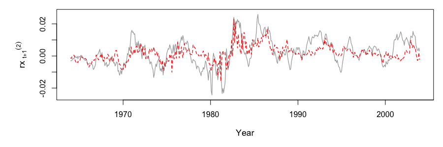
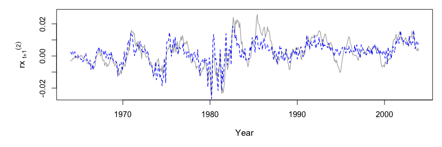
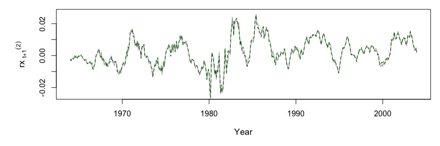

[](http://quantlet.de/)

## [](http://quantlet.de/) **PAMinsam** [](http://quantlet.de/)

```yaml

Name of Quantlet: PAMinsam

Published in: submitted to N/A 

Description: ‘Performs the Penalized Adaptive Method (PAM), a combination of 
propagation-separation approach and a SCAD penalty, to fit a model with possible 
structural changes on a given dataset. Compares the fit to models 
of Cochrane and Piazzesi (2005) and Ludvigson and Ng (2009). The input data are 
monthly observations of k-year excess bond risk premia, k = 2, 3, 4, 5, forward 
rates and other pre-defined macro variables. Computes RMSE, MAE, R^2 and adjusted 
R^2 for the fitted models. Plots the time series of the fitted vs. observed values 
of bond risk excess premia.'

Keywords: ‘linear model, regression, SCAD penalty, bic, time varying, change point, 
bootstrap, plot, visualization, nonstationary, financial, returns’

See also: ‘PAMsimLR, PAMsimCP, PAMCocPia, PAMoutsam’

Author: Lenka Zboňáková

Submitted:  23 May 2018 by Lenka Zboňáková

Datafile:  BRP_data.csv, LN_macrodata_transformed.csv

Input: 
- start.date   : Starting year of observations for PAM and CP 
- end.date     : Ending year of observations for PAM and CP 
- start.dateLN : Starting year of observations for LN 
- end.dateLN   : Ending year of observations for LN 
- Y.real       : Response variable (k-year excess bond risk premia, k = 2, 3, 4, 5)
- n.years      : Number of years as increment between successive subintervals
- n.boot       : Number of bootstrap loops
- mb.type      : Distribution of multipliers (Bound, Exp or Pois)

```







### R Code:
```r
# Clear all variables
rm(list = ls(all = TRUE))
graphics.off()

# Set directory
setwd("")

# Install and load packages
libraries = c("MASS", "bbmle", "glmnet", "doParallel", "LaplacesDemon", "optimx", "lars", 
              "scales", "tilting", "VGAM")
lapply(libraries, function(x) if (!(x %in% installed.packages())) {
  install.packages(x)} )
lapply(libraries, library, quietly = TRUE, character.only = TRUE)

# Call functions computing PAM
source("PAMfunc.r")

# Load data for PAM and Cochrane and Piazzesi (2005)
tmpdata      = read.csv("BRP_data.csv",sep=",") # Bond Risk Premium data
data         = sapply(subset(tmpdata, select = c(2:(ncol(tmpdata)))), as.numeric)
dates        = as.Date(as.character(as.POSIXct(as.character(tmpdata[, 1]), 
                                               format = "%Y%m%d")))

# Load macro data from Ludvigson and Ng (2009)
tmpdataLN    = read.csv("LN_macrodata_transformed.csv", sep=",") 
dataLN       = sapply(subset(tmpdataLN, select = c(2:ncol(tmpdataLN))), as.numeric)
datesLN      = as.Date(as.character(as.POSIXct(as.character(tmpdataLN[, 1]), 
                                               format = "%Y%m%d")))

# Model settings
# Define time span of the data
start.date    = grep("1964", dates)[1]
end.date      = grep("2003", dates)[12]

start.dateLN  = grep("1964", datesLN)[1]
end.dateLN    = grep("2003", datesLN)[12]

# Data selection 
covariatesCP  = data[start.date:end.date, 5:9]
covariatesLN  = dataLN[start.dateLN:end.dateLN, ]
BRP2          = data[start.date:end.date, 1]
BRP3          = data[start.date:end.date, 2]
BRP4          = data[start.date:end.date, 3]
BRP5          = data[start.date:end.date, 4]
n.obs         = nrow(covariatesCP)

# ----------------------------------------------------------------------------------------
# Cochrane and Piazzesi (2005): model with forward rates only
# ----------------------------------------------------------------------------------------
object.brp2   = lm(BRP2 ~ covariatesCP)
fit.brp2      = predict(object.brp2, as.data.frame(covariatesCP))
RMSE.brp2     = sqrt(1/n.obs * sum((BRP2 - fit.brp2)^2))
MAE.brp2      = 1/n.obs * sum(abs(BRP2 - fit.brp2))
Rsq.brp2      = sum((fit.brp2 - mean(BRP2))^2)/sum((BRP2 - mean(BRP2))^2) 
Radj.brp2     = 1 - ((1 - Rsq.brp2) * (n.obs - 1))/(n.obs - 5 - 1)

object.brp3   = lm(BRP3 ~ covariatesCP)
fit.brp3      = predict(object.brp3, as.data.frame(covariatesCP))
RMSE.brp3     = sqrt(1/n.obs * sum((BRP3 - fit.brp3)^2))
MAE.brp3      = 1/n.obs * sum(abs(BRP3 - fit.brp3))
Rsq.brp3      = sum((fit.brp3 - mean(BRP3))^2)/sum((BRP3 - mean(BRP3))^2) 
Radj.brp3     = 1 - ((1 - Rsq.brp3) * (n.obs - 1))/(n.obs - 5 - 1)

object.brp4   = lm(BRP4 ~ covariatesCP)
fit.brp4      = predict(object.brp4, as.data.frame(covariatesCP))
RMSE.brp4     = sqrt(1/n.obs * sum((BRP4 - fit.brp4)^2))
MAE.brp4      = 1/n.obs * sum(abs(BRP4 - fit.brp4))
Rsq.brp4      = sum((fit.brp4 - mean(BRP4))^2)/sum((BRP4 - mean(BRP4))^2) 
Radj.brp4     = 1 - ((1 - Rsq.brp4) * (n.obs - 1))/(n.obs - 5 - 1)

object.brp5   = lm(BRP5 ~ covariatesCP)
fit.brp5      = predict(object.brp5, as.data.frame(covariatesCP))
RMSE.brp5     = sqrt(1/n.obs * sum((BRP5 - fit.brp5)^2))
MAE.brp5      = 1/n.obs * sum(abs(BRP5 - fit.brp5))
Rsq.brp5      = sum((fit.brp5 - mean(BRP5))^2)/sum((BRP5 - mean(BRP5))^2) 
Radj.brp5     = 1 - ((1 - Rsq.brp5) * (n.obs - 1))/(n.obs - 5 - 1)

# Regression of the average excess return on all forward rates
avg.brp       = (BRP2 + BRP3 + BRP4 + BRP5)/4
object.avgbrp = lm(avg.brp ~ covariatesCP)
fit.avgbrp    = predict(object.avgbrp, as.data.frame(covariatesCP))

# Finding out b_n coefficients
object.2 = lm(BRP2 ~ fit.avgbrp)
b2       = object.2$coefficients[2]

object.3 = lm(BRP3 ~ fit.avgbrp)
b3       = object.3$coefficients[2]

object.4 = lm(BRP4 ~ fit.avgbrp)
b4       = object.4$coefficients[2]

object.5 = lm(BRP5 ~ fit.avgbrp)
b5       = object.5$coefficients[2]

# Fitting rx_(t+1)^n, n = 2, 3, 4, 5
fit.brp2cp  = b2 * fit.avgbrp
RMSE.brp2cp = sqrt(1/n.obs * sum((BRP2 - fit.brp2cp)^2))
MAE.brp2cp  = 1/n.obs * sum(abs(BRP2 - fit.brp2cp))
Rsq.brp2cp  = sum((fit.brp2cp - mean(BRP2))^2)/sum((BRP2 - mean(BRP2))^2) 
Radj.brp2cp = 1 - ((1 - Rsq.brp2cp) * (n.obs - 1))/(n.obs - 1 - 1)

fit.brp3cp  = b3 * fit.avgbrp
RMSE.brp3cp = sqrt(1/n.obs * sum((BRP3 - fit.brp3cp)^2))
MAE.brp3cp  = 1/n.obs * sum(abs(BRP3 - fit.brp3cp))
Rsq.brp3cp  = sum((fit.brp3cp - mean(BRP3))^2)/sum((BRP3 - mean(BRP3))^2) 
Radj.brp3cp = 1 - ((1 - Rsq.brp3cp) * (n.obs - 1))/(n.obs - 1 - 1)

fit.brp4cp  = b4 * fit.avgbrp
RMSE.brp4cp = sqrt(1/n.obs * sum((BRP4 - fit.brp4cp)^2))
MAE.brp4cp  = 1/n.obs * sum(abs(BRP4 - fit.brp4cp))
Rsq.brp4cp  = sum((fit.brp4cp - mean(BRP4))^2)/sum((BRP4 - mean(BRP4))^2) 
Radj.brp4cp = 1 - ((1 - Rsq.brp4cp) * (n.obs - 1))/(n.obs - 1 - 1)

fit.brp5cp  = b5 * fit.avgbrp
RMSE.brp5cp = sqrt(1/n.obs * sum((BRP5 - fit.brp5cp)^2))
MAE.brp5cp  = 1/n.obs * sum(abs(BRP5 - fit.brp5cp))
Rsq.brp5cp  = sum((fit.brp5cp - mean(BRP5))^2)/sum((BRP5 - mean(BRP5))^2) 
Radj.brp5cp = 1 - ((1 - Rsq.brp5cp) * (n.obs - 1))/(n.obs - 1 - 1)

# ----------------------------------------------------------------------------------------
# Ludvigson and Ng (2009): model with forward rates and macro factors
# ----------------------------------------------------------------------------------------
# Find first 8 factors as described in Ludvigson and Ng (2009)
object.PCA    = princomp(scale(covariatesLN), cor = FALSE)
factorsLN     = object.PCA$scores[, 1:8]

# Five factor + forward factor 
F5            = cbind(factorsLN[, 1], factorsLN[, 1]^3, factorsLN[, c(3, 4, 8)], 
                      fit.avgbrp)

object.brp2F5 = lm(BRP2 ~ F5)
fit.brp2F5    = predict(object.brp2F5, as.data.frame(F5))
RMSE.brp2F5   = sqrt(1/n.obs * sum((BRP2 - fit.brp2F5)^2))
MAE.brp2F5    = 1/n.obs * sum(abs(BRP2 - fit.brp2F5))
Rsq.brp2F5    = sum((fit.brp2F5 - mean(BRP2))^2)/sum((BRP2 - mean(BRP2))^2) 
Radj.brp2F5   = 1 - ((1 - Rsq.brp2F5) * (n.obs - 1))/(n.obs - 6 - 1)

object.brp3F5 = lm(BRP3 ~ F5)
fit.brp3F5    = predict(object.brp3F5, as.data.frame(F5))
RMSE.brp3F5   = sqrt(1/n.obs * sum((BRP3 - fit.brp3F5)^2))
MAE.brp3F5    = 1/n.obs * sum(abs(BRP3 - fit.brp3F5))
Rsq.brp3F5    = sum((fit.brp3F5 - mean(BRP3))^2)/sum((BRP3 - mean(BRP3))^2) 
Radj.brp3F5   = 1 - ((1 - Rsq.brp3F5) * (n.obs - 1))/(n.obs - 6 - 1)

object.brp4F5 = lm(BRP4 ~ F5)
fit.brp4F5    = predict(object.brp4F5, as.data.frame(F5))
RMSE.brp4F5   = sqrt(1/n.obs * sum((BRP4 - fit.brp4F5)^2))
MAE.brp4F5    = 1/n.obs * sum(abs(BRP4 - fit.brp4F5))
Rsq.brp4F5    = sum((fit.brp4F5 - mean(BRP4))^2)/sum((BRP4 - mean(BRP4))^2) 
Radj.brp4F5   = 1 - ((1 - Rsq.brp4F5) * (n.obs - 1))/(n.obs - 6 - 1)

object.brp5F5 = lm(BRP5 ~ F5)
fit.brp5F5    = predict(object.brp5F5, as.data.frame(F5))
RMSE.brp5F5   = sqrt(1/n.obs * sum((BRP5 - fit.brp5F5)^2))
MAE.brp5F5    = 1/n.obs * sum(abs(BRP5 - fit.brp5F5))
Rsq.brp5F5    = sum((fit.brp5F5 - mean(BRP5))^2)/sum((BRP5 - mean(BRP5))^2) 
Radj.brp5F5   = 1 - ((1 - Rsq.brp5F5) * (n.obs - 1))/(n.obs - 6 - 1)

# Six factor model           
F6            = cbind(factorsLN[, 1], factorsLN[, 1]^3, factorsLN[, c(2, 3, 4, 8)])

object.brp2F6 = lm(BRP2 ~ F6)
fit.brp2F6    = predict(object.brp2F6, as.data.frame(F6))
RMSE.brp2F6   = sqrt(1/n.obs * sum((BRP2 - fit.brp2F6)^2))
MAE.brp2F6    = 1/n.obs * sum(abs(BRP2 - fit.brp2F6))
Rsq.brp2F6    = sum((fit.brp2F6 - mean(BRP2))^2)/sum((BRP2 - mean(BRP2))^2) 
Radj.brp2F6   = 1 - ((1 - Rsq.brp2F6) * (n.obs - 1))/(n.obs - 6 - 1)

object.brp3F6 = lm(BRP3 ~ F6)
fit.brp3F6    = predict(object.brp3F6, as.data.frame(F6))
RMSE.brp3F6   = sqrt(1/n.obs * sum((BRP3 - fit.brp3F6)^2))
MAE.brp3F6    = 1/n.obs * sum(abs(BRP3 - fit.brp3F6))
Rsq.brp3F6    = sum((fit.brp3F6 - mean(BRP3))^2)/sum((BRP3 - mean(BRP3))^2) 
Radj.brp3F6   = 1 - ((1 - Rsq.brp3F6) * (n.obs - 1))/(n.obs - 6 - 1)

object.brp4F6 = lm(BRP4 ~ F6)
fit.brp4F6    = predict(object.brp4F6, as.data.frame(F6))
RMSE.brp4F6   = sqrt(1/n.obs * sum((BRP4 - fit.brp4F6)^2))
MAE.brp4F6    = 1/n.obs * sum(abs(BRP4 - fit.brp4F6))
Rsq.brp4F6    = sum((fit.brp4F6 - mean(BRP4))^2)/sum((BRP4 - mean(BRP4))^2) 
Radj.brp4F6   = 1 - ((1 - Rsq.brp4F6) * (n.obs - 1))/(n.obs - 6 - 1)

object.brp5F6 = lm(BRP5 ~ F6)
fit.brp5F6    = predict(object.brp5F6, as.data.frame(F6))
RMSE.brp5F6   = sqrt(1/n.obs * sum((BRP5 - fit.brp5F6)^2))
MAE.brp5F6    = 1/n.obs * sum(abs(BRP5 - fit.brp5F6))
Rsq.brp5F6    = sum((fit.brp5F6 - mean(BRP5))^2)/sum((BRP5 - mean(BRP5))^2) 
Radj.brp5F6   = 1 - ((1 - Rsq.brp5F6) * (n.obs - 1))/(n.obs - 6 - 1)

# ----------------------------------------------------------------------------------------
# PAM with forward rates and macro factors
# ----------------------------------------------------------------------------------------
# Define response variable and design matrix
Y.real  = BRP2
Y.set   = rev(Y.real)
X.set   = apply(cbind(covariatesCP, covariatesLN[, c(1, 3, 6, 19, 23, 25, 49, 70, 71, 72, 
                                                    80, 84:100, 110, 112, 113)]), 2, rev)

# Define pre-specified parameters
n.years = 4         # Number of years as increment between successive subintervals
n.boot  = 1000      # Number of bootstrapped multipliers
mb.type = "Pois"    # Bound, Exp or Pois

# Function for computing PAM on a given dataset
PAM.fit = function(X, Y, n.years){
  
  # Initial settings
  n.par       <<- ncol(X)             # Number of parameters in the model
  sd.eps      <<- 1                   # Assumed standard deviation
  a           <<- 3.7                 # Second parameter of SCAD method
  n.obsy      = length(Y)/n.obs * 12  # Number of observations per year
  b.pts       = numeric(0)            # Vector of change points
  m           = 1
  k1          = 1
  k2          = 2
  beta        = list()
  beta.0      = list()
  a0          = list()
  a0.0        = list()
  lambda      = list()
  bic         = list()
  
  # Definition of a sequence K and M (equal increments between successive subintervals)
  n.tmp = n.obsy * n.years
  if ((nrow(X)%%n.tmp) == 0){
    K     = rep(n.tmp, (nrow(X)%/%n.tmp))
  } else {
    K     = c(rep(n.tmp, (nrow(X)%/%n.tmp - 1)), 
              (nrow(X) - n.tmp * nrow(X)%/%n.tmp + n.tmp))
  }
  M     = length(K) 
  
  K.seq = 0
  for (i in 1:length(K)){
    K.seq = c(K.seq, sum(K[1:i]))
  }
  
  # 1.step: Fit the model for assumed homogeneous interval I_t^(1)
  X.tmp.L      = X[(K.seq[k1] + 1):K.seq[k2], ]
  Y.tmp.L      = Y[(K.seq[k1] + 1):K.seq[k2]]
  n.obs.tmp.L  = length(Y.tmp.L)
  object.tmp.L = Onestep.SCAD(X.tmp.L, Y.tmp.L, a, n.obs.tmp.L)
  beta[[m]]    = object.tmp.L$beta
  a0[[m]]      = object.tmp.L$a
  lambda[[m]]  = object.tmp.L$lambda
  beta.0[[m]]  = object.tmp.L$beta.0
  bic[[m]]     = object.tmp.L$bic
  
  while (m < M){
    # Fit the model over the next interval I_t^(k + 1) - I_t^(k)
    X.tmp.R      = X[(K.seq[k2] + 1):K.seq[(k2 + 1)], ]
    Y.tmp.R      = Y[(K.seq[k2] + 1):K.seq[(k2 + 1)]]
    n.obs.tmp.R  = length(Y.tmp.R)
    object.tmp.R = Onestep.SCAD(X.tmp.R, Y.tmp.R, a, n.obs.tmp.R)
    beta.tmp.R   = object.tmp.R$beta
    lambda.tmp.R = object.tmp.R$lambda
    beta0.tmp.R  = object.tmp.R$beta.0
    bic.tmp.R    = object.tmp.R$bic
    a.tmp.R      = object.tmp.R$a
    a0.tmp.R     = object.tmp.R$a.0
    
    # Fit the model over the whole interval I_t^(k + 1)
    X.tmp.T      = X[(K.seq[k1] + 1):K.seq[(k2 + 1)], ]
    Y.tmp.T      = Y[(K.seq[k1] + 1):K.seq[(k2 + 1)]]
    n.obs.tmp.T  = length(Y.tmp.T)
    object.tmp.T = Onestep.SCAD(X.tmp.T, Y.tmp.T, a, n.obs.tmp.T)
    beta.tmp.T   = object.tmp.T$beta
    lambda.tmp.T = object.tmp.T$lambda
    beta0.tmp.T  = object.tmp.T$beta.0
    bic.tmp.T    = object.tmp.T$bic
    a.tmp.T      = object.tmp.T$a
    a0.tmp.T     = object.tmp.T$a.0
    
    lik.T        = loglik.pen(a.tmp.T, beta0.tmp.T, beta.tmp.T, lambda.tmp.T, 
                              X.tmp.T, Y.tmp.T)
    
    # Simulation of multipliers u_i (i = 1, ..., n.obs.tmp.T)
    set.seed      = 20170424 * m * 10
    
    if (mb.type == "Bound"){
      multipliers   = matrix(runif.mod(n.boot * n.obs.tmp.T),     
                             ncol = n.obs.tmp.T, nrow = n.boot) # Bounded distribution
    }
    if (mb.type == "Exp"){
      multipliers   = matrix(rexp(n.boot * n.obs.tmp.T, rate = 1), 
                             ncol = n.obs.tmp.T, nrow = n.boot) # Exp(1) distribution
    }
    if (mb.type == "Pois"){
      multipliers   = matrix(rpois(n.boot * n.obs.tmp.T, lambda = 1), 
                             ncol = n.obs.tmp.T, nrow = n.boot) # Pois(1) distribution
    }
    
    MB.ratios = numeric(0)
    lik.sel   = numeric(0)
    sel       = 0   # Sequence of points where to divide new subinterval 
  
    for (ind in 1:length(sel)){
      lik.ratio     = numeric(0)
      
      # 1.step: Fit the model for assumed homogeneous interval I_t^(k,s)
      X.sel.L       = X[(K.seq[k1] + 1):(K.seq[k2] + sel[ind]), ]
      Y.sel.L       = Y[(K.seq[k1] + 1):(K.seq[k2] + sel[ind])]
      n.obs.sel.L   = length(Y.sel.L)
      object.sel.L  = Onestep.SCAD(X.sel.L, Y.sel.L, a, n.obs.sel.L)
      beta.sel.L    = object.sel.L$beta
      lambda.sel.L  = object.sel.L$lambda
      beta0.sel.L   = object.sel.L$beta.0
      bic.sel.L     = object.sel.L$bic
      a.sel.L       = object.sel.L$a
      a0.sel.L      = object.sel.L$a.0
      
      # 2. a) step: Fit the model over the next interval I_t^(k + 1) - I_t^(k,s)
      X.sel.R       = X[(K.seq[k2] + 1 + sel[ind]):K.seq[(k2 + 1)], ]
      Y.sel.R       = Y[(K.seq[k2] + 1 + sel[ind]):K.seq[(k2 + 1)]]
      n.obs.sel.R   = length(Y.sel.R)
      object.sel.R  = Onestep.SCAD(X.sel.R, Y.sel.R, a, n.obs.sel.R)
      beta.sel.R    = object.sel.R$beta
      lambda.sel.R  = object.sel.R$lambda
      beta0.sel.R   = object.sel.R$beta.0
      bic.sel.R     = object.sel.R$bic
      a.sel.R       = object.sel.R$a
      a0.sel.R      = object.sel.R$a.0
      
      # 2. b) step: Fit the model over the whole interval I_t^(k + 1)
      X.sel.T       = X.tmp.T
      Y.sel.T       = Y.tmp.T
      n.obs.sel.T   = n.obs.tmp.T
      
      # 3.step: Evaluate the test statistic
      # Real likelihood ratio
      lik.sel.L     = loglik.pen(a.sel.L, beta0.sel.L, beta.sel.L, lambda.sel.L, 
                                 X.sel.L, Y.sel.L)
      lik.sel.R     = loglik.pen(a.sel.R, beta0.sel.R, beta.sel.R, lambda.sel.R, 
                                 X.sel.R, Y.sel.R)
      lik.sel.T     = lik.T
      
      lik.sel       = c(lik.sel, (((n.obs.sel.L/n.obs.sel.T) * lik.sel.L)
                                  + ((n.obs.sel.R/n.obs.sel.T) * lik.sel.R) - lik.sel.T))
      
      for (l in 1:(n.boot)){
        # Multiplier bootstrap for left-hand interval I_t^(k,s)
        multipl.L      = multipliers[l, 1:n.obs.sel.L]
        
        boot.object.L  = Onestep.SCAD.MB(X.sel.L, Y.sel.L, a, n.obs.sel.L, 
                                         as.numeric(lambda.sel.L), multipl.L)
        
        boot.beta.L    = boot.object.L$beta
        boot.beta0.L   = boot.object.L$beta.0
        boot.a.L       = boot.object.L$a
        boot.a0.L      = boot.object.L$a.0
        
        lik.boot.L     = loglik.pen.MB(boot.a.L, boot.beta0.L, boot.beta.L, 
                                       as.numeric(lambda.sel.L), X.sel.L, Y.sel.L, 
                                       multipl.L)
        
        # Multiplier bootstrap for right-hand interval I_t^(k + 1) - I_t^(k,s)
        multipl.R     = multipliers[l, (n.obs.sel.L + 1):n.obs.sel.T]
        
        boot.object.R = Onestep.SCAD.MB(X.sel.R, Y.sel.R, a, n.obs.sel.R, 
                                        as.numeric(lambda.sel.R), multipl.R)
        
        boot.beta.R   = boot.object.R$beta
        boot.beta0.R  = boot.object.R$beta.0
        boot.a.R      = boot.object.R$a
        boot.a0.R     = boot.object.R$a.0
        
        lik.boot.R    = loglik.pen.MB(boot.a.R, boot.beta0.R, boot.beta.R, 
                                      as.numeric(lambda.sel.R), X.sel.R, Y.sel.R,
                                      multipl.R)
        
        # Multiplier bootstrap for the whole interval I_t^(k + 1) (with shift)
        multipl       = multipliers[l, ]
        
        boot.object.T = Onestep.SCAD.MB.shift(X.sel.L, Y.sel.L, X.sel.R, Y.sel.R, a, 
                                              lambda.sel.L, lambda.sel.R, multipl.L, 
                                              multipl.R, beta.sel.L, beta.sel.R, 
                                              a.sel.L, a.sel.R)
        
        boot.beta.T   = boot.object.T$beta
        boot.lambda.T = boot.object.T$lambda
        boot.beta0.T  = boot.object.T$beta.0
        boot.a.T      = boot.object.T$a
        boot.a0.T     = boot.object.T$a.0
        
        Y.boot.T      = c(Y.sel.L, (Y.sel.R - rep((a.sel.R - a.sel.L), n.obs.sel.R) 
                                    - X.sel.R %*% (beta.sel.R - beta.sel.L)))
        
        lik.boot.T    = loglik.pen.MB(boot.a.T, boot.beta0.T, boot.beta.T, boot.lambda.T, 
                                      X.sel.T, Y.boot.T, multipl)
        
        lik.ratio     = c(lik.ratio, ((n.obs.sel.L/n.obs.sel.T) * lik.boot.L 
                                      + (n.obs.sel.R/n.obs.sel.T) * lik.boot.R 
                                      - lik.boot.T))
        
      }
      
      MB.ratios = cbind(MB.ratios, lik.ratio)
    }
    
    # Find maximum over the real and bootstrapped likelihood ratios
    t.stat        = max(lik.sel)
    MB.ratios.max = apply(MB.ratios, 1, max)
    
    q90     = quantile(MB.ratios.max, probs = 0.9)
    q95     = quantile(MB.ratios.max, probs = 0.95)
    
    k2 = k2 + 1
    m  = m + 1
    
    # 5.step: Test for homogeneity and evaluate current beta estimator
    if (t.stat <= q95){
      for (k3 in k1:m){
        beta[[k3]]   = beta.tmp.T
        a0[[k3]]     = a.tmp.T
        lambda[[k3]] = lambda.tmp.T
      }
    } else {
      b.pts       = c(b.pts, (K.seq[m] + 1))
      k1          = k2 - 1
      beta[[m]]   = beta.tmp.R
      a0[[m]]     = a.tmp.R
      lambda[[m]] = lambda.tmp.R
    } 
  }
  
  # Find fitted values of Y
  Y.fitted = numeric(0)
  b.pts.seq  = c(1, b.pts, (K.seq[length(K.seq)] + 1))
  lb.pts.seq = length(b.pts.seq)
  for (k in 1:(lb.pts.seq - 1)){
    k1       = b.pts.seq[k]
    k2       = b.pts.seq[(k + 1)] - 1
    k3       = which(K.seq == k2) - 1
    Y.tmp    = Y[k1:k2]
    no.tmp   = length(Y.tmp)
    X.tmp    = X[k1:k2,]
    Y.fitted = c(Y.fitted, (X.tmp %*% beta[[k3]] + rep(a0[[k3]], no.tmp)))
  }
  
  # Compute average number of nonzero coefficients
  act.set = numeric(0)
  for (m in 1:M){
    act.set = c(act.set, sum(beta[[m]] != 0)) 
  }
  
  values   = list(Y.fitted, beta, a0, b.pts, mean(act.set))
  names(values) = c("Y.fitted", "beta", "a0", "b.pts", "as.avg")
  return(values)
}

# Fit the model to selected data
object.pam = PAM.fit(X.set, Y.set, n.years)
Y.fittmp   = object.pam$Y.fitted
Y.fitted   = rev(Y.fittmp)

RMSE.pam   = sqrt(1/n.obs * sum((Y.real - Y.fitted)^2))
MAE.pam    = 1/n.obs * sum(abs(Y.real - Y.fitted))
Rsq.pam    = sum((Y.fitted - mean(Y.real))^2)/sum((Y.real - mean(Y.real))^2)
Radj.pam   = 1 - ((1 - Rsq.pam) * (n.obs - 1))/(n.obs - object.pam$as.avg - 1)

# Plot all of the models vs. observations
par(mfrow = c(1 ,1))
par(mar = c(5,6,1,1))
at.tmp  = c(grep("1970", dates)[1], grep("1980", dates)[1], grep("1990", dates)[1], 
            grep("2000", dates)[1]) - (start.date) + 1

plot(Y.real, type = "l", col = "darkgray", 
     ylim = c((min(Y.real)-0.007), (max(Y.real)+0.002)), 
     axes = FALSE, xlab = "Year", frame = TRUE,
     ylab = expression(paste("rx " [t+1]) ^ {(2)}), cex.lab = 1.1, lwd = 1.3)
axis(1, cex.axis = 1, labels = seq(1970, 2000, 10), at = at.tmp)
axis(2, cex.axis = 1)
lines(fit.brp2cp, col = "red", lty = 2, lwd = 1.3)

plot(Y.real, type = "l", col = "darkgray", 
     ylim = c((min(Y.real)-0.007), (max(Y.real)+0.002)), 
     axes = FALSE, xlab = "Year", frame = TRUE,
     ylab = expression(paste("rx " [t+1]) ^ {(2)}), cex.lab = 1.1, lwd = 1.3)
axis(1, cex.axis = 1, labels = seq(1970, 2000, 10), at = at.tmp)
axis(2, cex.axis = 1)
lines(fit.brp2F6, col = "blue", lty = 2, lwd = 1.3)

plot(Y.real, type = "l", col = "darkgray",
     ylim = c((min(Y.real)-0.007), (max(Y.real)+0.002)), 
     axes = FALSE, xlab = "Year", frame = TRUE,
     ylab = expression(paste("rx " [t+1]) ^ {(2)}), cex.lab = 1.1, lwd = 1.3)
axis(1, cex.axis = 1, labels = seq(1970, 2000, 10), at = at.tmp)
axis(2, cex.axis = 1)
lines(Y.fitted, col = "darkgreen", lty = 2, lwd = 1.3)

```
